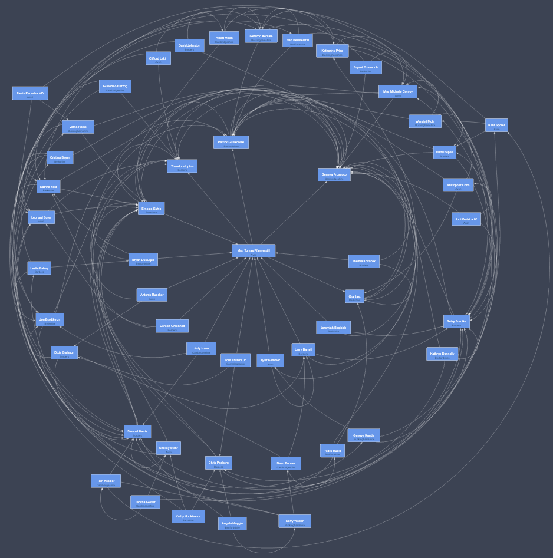

# yFiles CSS styling elements

This is a collection of custom styles for arrows, nodes and edges allowing for CSS styling. Note that it does not mean you can use all of the CSS magic. For instance, drop-shadow does not work on SVG elements like Rect. On the other hand, CSS animation is something which would be difficult via code or SVG constructs. 

## Setup

- You need a license to run this project, see [the yWorks website](https://my.yworks.com) for a trial. Insert this license in the `app/scripts/app.ts` file.
- Make sure the path to the yFiles `yfiles-*.tgz` file is set in `package.json`.
- Install things as usual with `npm i`.
- Run it with `npm start`.

## Info and Support

Info and support [@TheOrbifold](https://twitter.com/theorbifold). 
